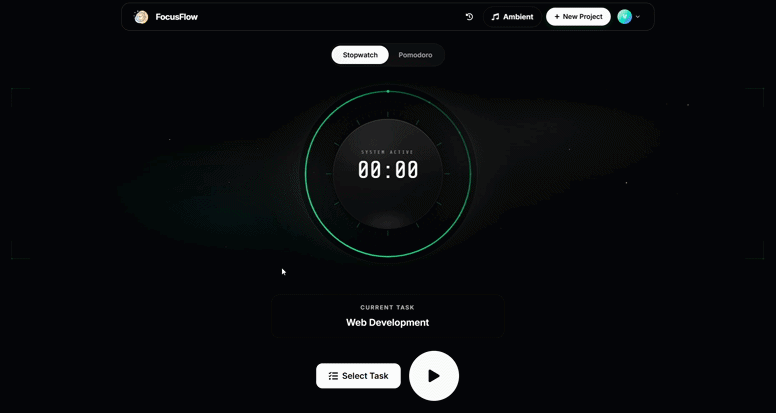
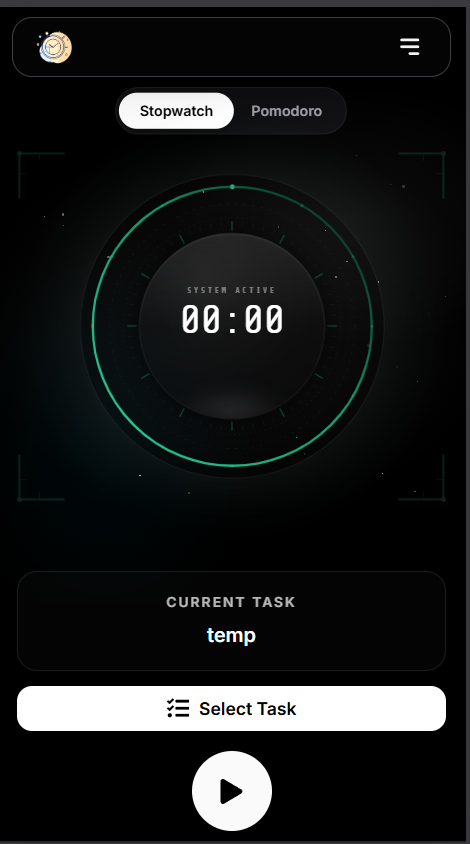
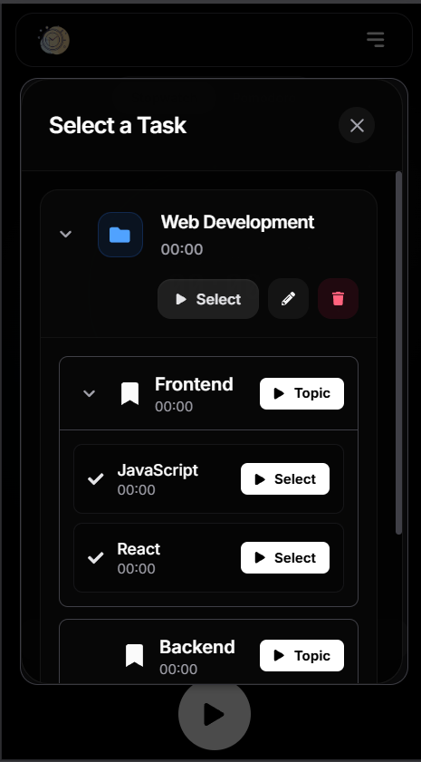
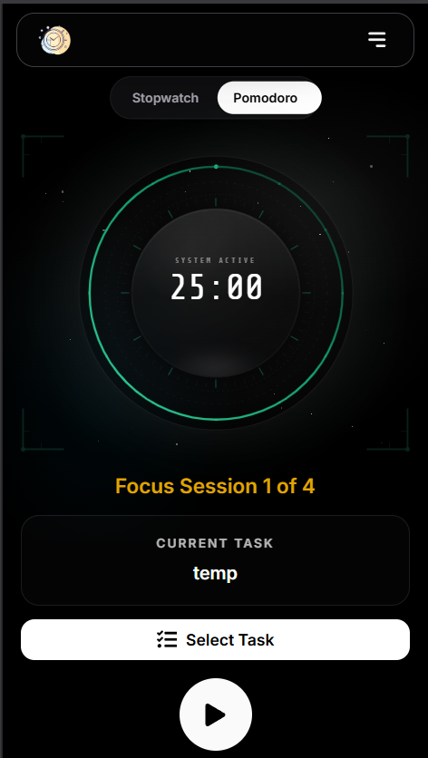
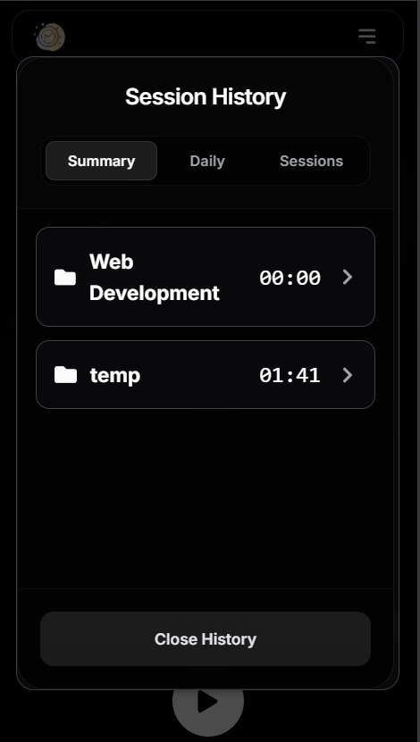

# FocusFlow

FocusFlow is a study productivity app that helps you stay consistent with focused deep work.

It combines:

- a stopwatch mode for open-ended study sessions
- a Pomodoro mode with work and break cycles
- project, topic, and sub-topic tracking
- Firebase-backed history and progress persistence
- Android-native polish via Capacitor (haptics, status bar, splash screen, keyboard handling)

## Highlights ✨

- Task-based session tracking: project, topic, and sub-topic level
- Session history with saved durations
- Pomodoro cycle support (work, short break, long break)
- Sound cues for start/countdown/end
- Smooth animated UI built with Framer Motion
- Android app support through Capacitor

## Demo 🎬

### GIF Walkthrough



### Screenshots 📸

| Home                                       | Task Selection                                   |
| ------------------------------------------ | ------------------------------------------------ |
|  |  |

| Pomodoro Mode                                  | Session History                                    |
| ---------------------------------------------- | -------------------------------------------------- |
|  |  |

## Tech Stack 🛠️

- React 19 + Vite 7
- Firebase (Auth + Firestore + Hosting)
- Capacitor 8 (Android)
- Tailwind CSS 4
- Framer Motion + React Icons + Tone.js

## Project Structure 📁

Key folders:

- `src/Components` -> UI components
- `src/hooks` -> timer and state hooks
- `src/services` -> audio/native bridge services
- `src/firebase` -> Firebase config and integration
- `android` -> native Android project (Capacitor)

## Getting Started 🚀

### 1. Prerequisites

- Node.js 18+
- npm 9+
- Android Studio (for Android build/run)
- Java 17+ (recommended for current Android Gradle toolchains)

### 2. Install Dependencies

```bash
npm install
```

### 3. Run Web App (Development)

```bash
npm run dev
```

Open the shown local URL in your browser.

### 4. Build Production Web Bundle

```bash
npm run build
```

### 5. Preview Production Build

```bash
npm run preview
```

## Android App (Capacitor) 📱

After any web changes you want in Android:

```bash
npm run build
npx cap sync android
```

Open in Android Studio:

```bash
npx cap open android
```

Then run on emulator/device from Android Studio.

## Firebase Setup 🔐

Current config is in `src/firebase/config.js`.

If you use your own Firebase project, update values in that file and ensure:

- Firestore is enabled
- Authentication is enabled (Google provider)
- Web app credentials are valid

For Android Google Sign-In/Firebase support, keep `android/app/google-services.json` aligned with your Firebase project.

## Scripts ⚙️

- `npm run dev` -> run development server
- `npm run build` -> create production build in `dist`
- `npm run preview` -> preview production build locally
- `npm run lint` -> run ESLint

## Deployment (Firebase Hosting) 🌐

This repo is already configured with SPA rewrites in `firebase.json`.

Typical deploy steps:

```bash
npm run build
firebase deploy
```

## Troubleshooting 🧰

- Android changes not reflecting:
  - run `npm run build` then `npx cap sync android`
- First sound on mobile is delayed:
  - user interaction is required before audio context starts
- Firebase auth issues:
  - verify auth provider setup and matching app SHA/package config

## Roadmap Ideas 🗺️

- Export study analytics
- Better onboarding and reminders
- Offline-first session queueing
- More timer customization presets

## License 📄

No license file is currently present.
Add a `LICENSE` file if you plan to open-source under a specific license.
